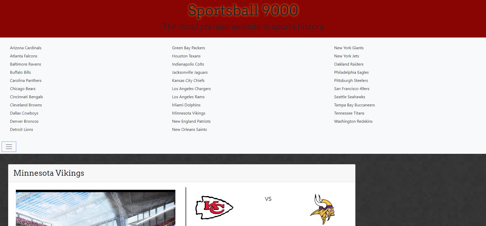
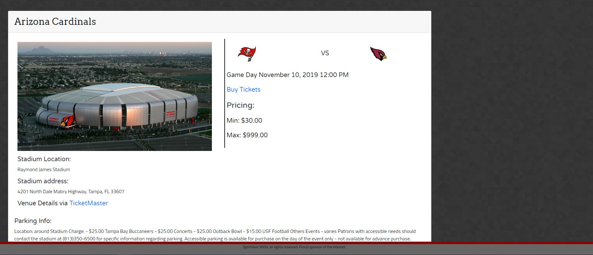
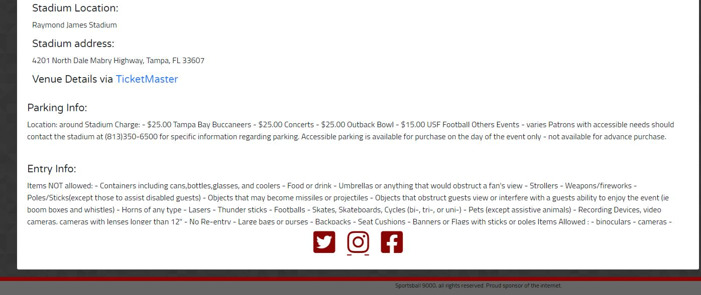

# Sportsball 9000

We at Team Simpsons decided to give the sports enthusiasts an app that would make their life less stressful when it comes to following their favorite football team and having the ability to go watch them in person.  Sportsball 9000 allows the user to search their favorite football team and also gives them up-to-date ticket information.

## Motivation

Sportsball 9000 provides a uniquely immersive and all-encompassing experience that will completely revolutionize the way you experience the National Football League.

## How to use? 

The user will be able to utilize the NFL team tab to select any one of the 32 teams.  From there, they will be able to use our site as a resource to learn more about each team (including stadium information, parking, date of games, price range, and entry information).  Our website is unique in its dual functionality as both an informational database and as a ticket vendor.

## Screenshots

## Tech/framework used

Built with HTML5, css, Google Fonts, Bootstrap, and font awesome. 
   APIs used: 
--[The Sports DB API](https://www.thesportsdb.com/api/v1/json/)  
--[TicketMaster API](https://app.ticketmaster.com/discovery/v2/events.json?)

## Features
Our website produces ticket information such as price range, parking info, and stadium entry guidelines.

## API Reference

 --[The Sports DB API](https://www.thesportsdb.com/api/v1/json/)
  
 --[TicktMaster API](https://app.ticketmaster.com/discovery/v2/events.json?)

## Credits

<!-- Include team members -->
--Brooke Kumar
--Henry Johnson
--James Bothham  
--Keith Kleinschmidt
--Richard Tshabalala